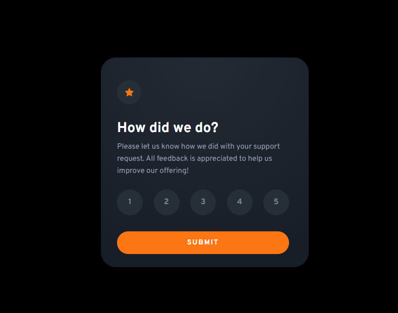

# Frontend Mentor - Interactive rating component solution

This is a solution to the [Interactive rating component challenge on Frontend Mentor](https://www.frontendmentor.io/challenges/interactive-rating-component-koxpeBUmI). Frontend Mentor challenges help you improve your coding skills by building realistic projects.

## Table of contents

- [The challenge](#the-challenge)
- [Screenshot](#screenshot)
- [Links](#links)
- [Built with](#built-with)
- [What I learned](#what-i-learned)

### The challenge

Users should be able to:

- View the optimal layout for the app depending on their device's screen size
- See hover states for all interactive elements on the page
- Select and submit a number rating
- See the "Thank you" card state after submitting a rating

### Screenshot



### Links

- Solution URL: [https://github.com/HarLey021/Rating-Component]
- Live Site URL: [https://rating-component-woad.vercel.app/]

### Built with

- HTML
- CSS
- Flexbox
- Mobile-first workflow
- [React] - JS library
- [CSS Modules] - For styles

### What I learned

Main thing I learned with this project are conditional rendering, which I used for sisplaying components at right time.

```js
{
  showThanksCard && <ThanksCard selectedRating={selectedRating} />;
}
```
